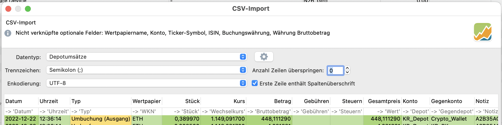
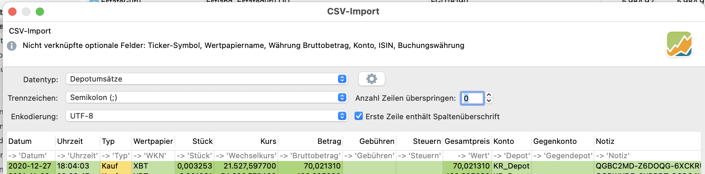

# PP-Crypto-Parser
Parser for preparing trade data from kraken for Portfolio Performance

## Input
- Ledger data from [kraken.com](https://kraken.com)
- Historical cryptocurrency prices from Portfolio Performance

## Output
- CSV file compatible with the CSV import of [Portfolio Performance (PP)](https://www.portfolio-performance.info/)

## How does it work?
This parser needs the ledger data exported from Kraken as well as the historical prices of the cryptocurrencies exported from Portfolio Performance. It then groups the transactions from Kraken by ID (e.g. one transaction with ID 123 receiving Bitcoin, and another transaction with the same ID that is spending Euros). For calculating the value of transactions in Euros, the historical prices from Portfolio Performance are used, so that no additional API needs to be implemented. This parser outputs three CSV files, which can then be imported into Portfolio Performance - one file is for all account transactions (e.g. deposits/withdrawals in Euros), one for all depot transactions (e.g. buying Bitcoin) and the last one for staking rewards (which are currently implemented as deposits of the staked currency).

Detailed examples of how the input looks like, and how the generated output looks like, can be found in `src/test/process_ledger_test.py`.

## Comments
- Project is a Work-in-Progress (WIP)

## Step-by-step
1. Export all `ledger` data from kraken
    1. On the kraken website, choose `History` in the top menu, then `Export`
    2. Change export to `Ledgers`, make sure that `All fields` are exported for your wanted timeframe
    3. Click on `Submit` and wait until your export is ready (refresh site)
    4. Once status is `Processed`, click on three dots on the right and choose `Download`
2. Export all history crypto rates from Portfolio Performance (PP)
    1. In PP, choose `File` - `Export` - `CSV...`
    2. Scroll to the bottom and choose `Securities` - `All historic rates` and choose storage location
3. Run `cli.py` with the following parameters (see `cli.py` for help)
    - `PP_RATES_FILE` historical rates file exported from PP (required)
    - `KRAKEN_CSV_FILE` kraken ledger export (required)
    - optional parameters (see section "Command Line Arguments")
        - `-cm` can be used to specify mapping between PP Symbol and Kraken crypto currency abbreviation if they differ
4. Import the generated CSV files in Portfolio Performance
    - Import `transactions_account.csv` as account data (it includes deposits and withdrawals and costs for transfers)
    - Import `transactions_normal_depot.csv` as transaction data (it includes buying and seeling cryptocurrencies)
    - Import `transactions_special_depot.csv` as transaction data and **check the box to transform them to transfers instead of buys**


## Command Line Arguments
```
cli.py -h                                          
usage: cli.py [-h] [-cm CURRENCY_MAPPING] [-fc FIAT_CURRENCY] [-ir REFIDS_TO_IGNORE] [-o OUT_DIR] [-do DEPOT_OLD] [-dn DEPOT_NEW] [-a ACCOUNT] [-v]
              [PP_RATES_FILE] [KRAKEN_CSV_FILE]

Parse Kraken Crypto Transactions for Portfolio Performance Import.

positional arguments:
  PP_RATES_FILE         portfolio performance rates export
  KRAKEN_CSV_FILE       kraken ledger export csv file

options:
  -h, --help            show this help message and exit
  -cm CURRENCY_MAPPING, --currency-mapping CURRENCY_MAPPING
  -fc FIAT_CURRENCY, --fiat-currency FIAT_CURRENCY
                        define base currency (def=EUR)
  -ir REFIDS_TO_IGNORE, --ignore-refids REFIDS_TO_IGNORE
                        Comma-separated list of refids to ignore while processing
  -o OUT_DIR, --out-dir OUT_DIR
                        Directory to store PP transactions in (def=cwd)
  -do DEPOT_OLD, --depot-old DEPOT_OLD
                        Name of current/old depot (def=DEPOT)
  -dn DEPOT_NEW, --depot-new DEPOT_NEW
                        Name of new depot (target of transfers, def=DEPOT_NEW)
  -a ACCOUNT, --account ACCOUNT
                        Name of account, def=ACCOUNT
  -v, --verbose         Activate verbose mode
```

Example:
```
python cli.py -fc 'EUR' -o './output/' -v './input/Alle_historischen_Kurse.csv' './input/ledgers.csv' -cm '{"XBT-EUR": "BTC-EUR"}'
```

## Details for Importing Files into Portfolio Performance

### transactions_account.csv


### transactions_normal_depot.csv


### transactions_special_depot.csv

And do not forget to check the following box to import staking rewards as "deposits":
